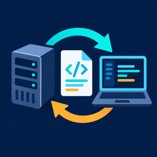

# IBM i Member Workspace

<p>
  
</p>

Bring IBM i source members into a local workspace, edit them offline, and synchronize changes safely using VS Code's built-in diff editor. Works with [Code for IBM i](https://marketplace.visualstudio.com/items?itemName=HalcyonTechLtd.code-for-ibmi).

> **Project origin:** IBM i Member Workspace is an independently maintained project derived from [IBMi Source Member Checkout](https://github.com/thomprl/ibmi-source-member-checkout), originally created by Ricky Thompson. It is distributed under GPL-3.0; see [NOTICE](NOTICE) for attribution.

## Why?

Editing source members directly through Code for IBM i saves straight to the IBM i on every keystroke-save. This extension lets you **check out a local copy**, work at your own pace, and **merge changes back** when ready — with full diff support and source date preservation. This allows AI tools to work with your source files locally.

By default, local copies are stored in this extension's private storage. Set **Local Folder** if you want the files in an easier-to-open workspace location.

## Features

### Check Out Members

Right-click a member in the Code for IBM i Object Browser and choose **Check Out Member**. The source downloads to a local file (named after the member, e.g. `EXAMPLE.RPGLE`, for correct compilation) organized by system, library, and source file, and shows up in the **Checked Out Members** panel.

Select multiple members (Ctrl/Shift-click) before checking out, and they're all downloaded together — if any are already checked out, you're asked once whether to re-download or skip them.

### Check Out All Members

Right-click a **source file** (one level above members) and choose **Check Out All Members** to pull down every member it contains in one go. Since this can mean a lot of members, a confirmation dialog warns that it may take a while before starting.

### Protected Filter Members

Checkout is hidden by default for members in a protected (read-only) filter. Enable `ibmi-member-workspace.allowCheckoutFromProtectedFilter` to allow it when you deliberately want a local working copy of a protected source.

### Merge Back to IBM i

Right-click a checkout and choose **Merge Back to IBM i** to open a diff view — your local changes on the left, the live remote member on the right. Use VS Code's merge arrows to selectively apply changes, then save the remote side; Code for IBM i handles the upload and **preserves source dates**.

### Upload to IBM i

For a quick full replace, use **Upload to IBM i**. This overwrites the remote member with your local copy. A warning confirms that **source dates will not be preserved**.

Before uploading, the extension checks whether the member has changed on the IBM i since you checked it out. If it has, you're asked to **Overwrite Anyway** or **Show Diff** instead of silently losing the remote changes. In a multi-member upload, members changed on the IBM i are skipped and listed in the IBM i Member Workspace output panel.

### Refresh Remote Status

Compares your local file, the live remote content, and the remote content as it was at checkout time (not just a stale comparison) to classify each checkout:

- **In sync** — local matches remote exactly
- **Modified** — you've edited locally; remote is unchanged (safe — nothing to lose)
- **Remote changed** — the member changed on the IBM i but your local copy is untouched (safe to re-checkout)
- **Conflict** — changed both locally *and* on the IBM i (re-checkout would discard your edits — review with Merge Back first)

Refresh per member (inline icon or context menu, with a prompt to Re-checkout or review the diff when the remote has changed), per source file group, or for every checkout at once from the panel toolbar. Bulk refreshes show per-member progress and can be cancelled.

### Compare With

Right-click a checkout for comparison tools: **Select for Compare** (mark one checkout, then **Compare with Selected** on another), **Compare with Active File**, **Compare with Local File**, **Compare with IFS File**, or **Compare with Member** (any source member by path).

### Other Actions

- **Open Local File** / **Open Remote File** — open either copy in the editor
- **Run Action** — trigger Code for IBM i's local source actions (compile, deploy, etc.)
- **Reveal in File Explorer** — show the local file in your OS file manager
- **Copy Member Path** — copy `LIBRARY/SOURCEFILE(MEMBER)` to the clipboard
- **Discard Checkout** — delete the local file and stop tracking it (with confirmation)

### Multi-Select

The Checked Out Members panel supports selecting multiple checkouts at once. **Open Local/Remote File, Run Action, Upload to IBM i, Refresh Remote Status,** and **Discard Checkout** all work on a multi-selection, each confirming with a message naming how many members the action will affect before proceeding. Actions that only make sense for one item at a time (Merge Back, Compare With, Copy Member Path, Reveal in File Explorer) are single-selection only.

## Settings

| Setting | Default | Description |
|---------|---------|-------------|
| `ibmi-member-workspace.localFolder` | *(empty)* | Custom folder for checked-out files. Leave empty to use extension storage. |
| `ibmi-member-workspace.warnOnRedownload` | `true` | Show warning when checking out a member that is already checked out. |
| `ibmi-member-workspace.autoOpenOnCheckout` | `true` | Automatically open the file in the editor after a single-member checkout. |
| `ibmi-member-workspace.allowCheckoutFromProtectedFilter` | `false` | Allow checking out members from protected (read-only) filters. |

## Local File Structure

```
checkouts/
  myhost.company.com/
    MYLIB/
      QRPGLESRC/
        PAYROLL.RPGLE
      QCLSRC/
        PAYROLLC.CLLE
```

Organizing by system, library, and source file preserves the original filename for compilation and prevents collisions across different IBM i systems.

## Requirements

- VS Code 1.90 or later
- [Code for IBM i](https://marketplace.visualstudio.com/items?itemName=HalcyonTechLtd.code-for-ibmi) v3.0.0 or later
- Active connection to an IBM i system

## Building from Source

### Prerequisites

- [Node.js](https://nodejs.org/) 22 or later (includes npm)
- VS Code 1.90 or later, with [Code for IBM i](https://marketplace.visualstudio.com/items?itemName=HalcyonTechLtd.code-for-ibmi) installed

### Build

```sh
git clone https://github.com/vinhry/ibmi-member-workspace.git
cd ibmi-member-workspace
npm ci             # install the locked dependencies
npm run compile    # compile TypeScript into out/
```

Other useful scripts:

| Command | What it does |
|---------|--------------|
| `npm run watch` | Recompile automatically whenever a source file changes |
| `npm run lint` | Check the source with ESLint |
| `npm test` | Compile and run the unit tests |
| `npm run package:list` | Preview the files that will be included in the VSIX |
| `npm run package` | Compile and build the installable VSIX |

### Run Without Installing (Development)

1. Open the project folder in VS Code.
2. In a terminal, run `npm run watch` and leave it running.
3. Press **F5**. When asked to pick a debugger, choose **VS Code Extension Development**.
4. A second VS Code window titled **[Extension Development Host]** opens with the extension loaded. Connect to your IBM i there to try it out.
5. After changing code, press **Ctrl+R** (**Cmd+R** on macOS) in that window to reload it.

### Package and Install

1. Package the extension as a `.vsix` file:

   ```sh
   npm run package
   ```

   This compiles the project and creates `ibmi-member-workspace-<version>.vsix` in the project folder.

2. Install the `.vsix` using either of these:
   - **From VS Code:** open the Extensions view (**Ctrl+Shift+X** / **Cmd+Shift+X**), click the **...** menu at the top of the view, choose **Install from VSIX...**, and select the file.
   - **From a terminal:**

     ```sh
     code --install-extension ibmi-member-workspace-<version>.vsix
     ```

     On macOS, if `code` isn't found, open the Command Palette in VS Code and run **Shell Command: Install 'code' command in PATH**.

3. Reload VS Code when prompted. The **Member Workspace** icon appears in the Activity Bar once you connect to an IBM i.

To update, package and install the new `.vsix` the same way; it replaces the installed version. To remove the extension, find **IBM i Member Workspace** in the Extensions view and choose **Uninstall**.

### Moving from Another Checkout Extension

IBM i Member Workspace has its own command IDs, settings, views, and extension storage. It can be enabled alongside the original extension, but it does not import or share checkout metadata.

1. Finish or back up any local work in the original extension.
2. Install **IBM i Member Workspace** from the Marketplace or its VSIX.
3. Configure `ibmi-member-workspace.localFolder` if desired.
4. Check out the members you want this extension to track.

Do not configure two checkout extensions to use the same local folder. Existing files are not tracked until they are checked out with IBM i Member Workspace.

## Releases

The public source for each release is tagged in this repository. Release VSIX files are also attached to [GitHub Releases](https://github.com/vinhry/ibmi-member-workspace/releases). The Marketplace extension ID is `vinhry.ibmi-member-workspace`.

## Support

Report problems and request features through the [IBM i Member Workspace issue tracker](https://github.com/vinhry/ibmi-member-workspace/issues). This project is maintained and supported independently.

## License and Attribution

GPL-3.0. This project is derived from GPL-licensed work; see [NOTICE](NOTICE) for its origin and maintenance information.
