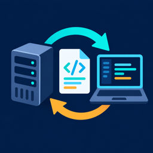

# IBM i Member Workspace

<p>
  
</p>

Bring IBM i source members into a local workspace, edit them offline, and synchronize changes safely using VS Code's built-in diff editor. Works with [Code for IBM i](https://marketplace.visualstudio.com/items?itemName=HalcyonTechLtd.code-for-ibmi).

> **Project origin:** IBM i Member Workspace is an independently maintained project derived from [IBMi Source Member Checkout](https://github.com/thomprl/ibmi-source-member-checkout), originally created by Ricky Thompson. It is distributed under GPL-3.0; see [NOTICE](NOTICE) for attribution.

## Why?

Editing source members directly through Code for IBM i saves straight to the IBM i on every keystroke-save. This extension lets you **check out a local copy**, work at your own pace, and **merge changes back** when ready — with full diff support and source date preservation. This allows AI tools to work with your source files locally.

Before the first checkout in each VS Code workspace, choose a visible local folder for member files. The extension never silently stores checked-out members inside its installation or private storage.

## First-Time Setup

1. Open a folder or `.code-workspace` file in VS Code.
2. When prompted, select **Choose Folder**, or run **IBM i Member Workspace: Configure Checkout Folder** from the Command Palette.
3. Select the directory that should contain checked-out members for this workspace.

The folder selection and checkout index are private to the current VS Code workspace and are not written to `.vscode/settings.json`. To change the folder later, first merge or discard every tracked checkout, then run **Configure Checkout Folder** again.

## Features

### Check Out Members

Right-click a member in the Code for IBM i Object Browser and choose **Check Out Member**. The source downloads to a local file (named after the member, e.g. `EXAMPLE.RPGLE`, for correct compilation) organized by system, library, and source file, and shows up in the **Checked Out Members** panel.

Select multiple members (Ctrl/Shift-click) before checking out, and they're all downloaded together — if any are already checked out, you're asked once whether to re-download or skip them.

### Check Out All Members

Right-click a **source file** (one level above members) and choose **Check Out All Members** to pull down every member it contains in one go. Since this can mean a lot of members, a confirmation dialog warns that it may take a while before starting.

### Protected Filter Members

Checkout is hidden by default for members in a protected (read-only) filter. Enable `ibmi-member-workspace.allowCheckoutFromProtectedFilter` to allow it when you deliberately want a local working copy of a protected source.

### Merge Back to IBM i

Right-click a checkout and choose **Merge Back to IBM i** to open a diff view — your local changes on the left, the live remote member on the right. Use VS Code's merge arrows to selectively apply changes, then save the remote side; Code for IBM i handles the upload and **preserves source dates**.

### Upload to IBM i

For a quick full replace, use **Upload to IBM i**. This overwrites the remote member with your local copy.

When **Enable source dates** is on in Code for IBM i's connection settings (Source Code), the upload saves through Code for IBM i just like editing the member there: unchanged lines **keep their source dates**, and inserted or changed lines are dated today. Sequence numbers are renumbered, as when saving in the Code for IBM i editor. Line endings (CRLF or LF) in the local file do not affect the dates, and blank lines at the end of the local file are not uploaded, so the member never ends with empty records. When source dates are disabled, the confirmation warns that every date will be reset to 0.

Before uploading, the extension checks whether the member has changed on the IBM i since you checked it out. If it has, you're asked to **Overwrite Anyway** or **Show Diff** instead of silently losing the remote changes. In a multi-member upload, members changed on the IBM i are skipped and listed in the IBM i Member Workspace output panel.

After uploading, the member is read back from the IBM i. If what was stored differs from your local file (for example, a line longer than the record length was truncated), you're warned and the checkout stays **Modified** so you can review it with Merge Back.

#### Checks Before Uploading

Before uploading, the local copy is checked for text the member can't hold:

- **Lines that are too long.** A source file holds a fixed number of characters per line (80 for a source file created with `RCDLEN(92)`), and the IBM i cuts off the rest of a longer line. Trailing blanks don't count.
- **Characters the member's CCSID can't store.** Typographic quotes (“ ”), dashes (– —) and ellipses (…), which word processors and AI tools often add, can't be stored in CCSID 37, for example, and the IBM i replaces them. Characters are checked for the common single-byte EBCDIC CCSIDs (37, 273, 277, 278, 280, 284, 285, 297, 500, 871, 1047, and 1140 to 1149). For other CCSIDs, only the line length is checked.

When either is found, you're asked to **Upload Anyway** or **Show Problems**. With upload on save, a notification asks instead, so it doesn't hold up your next save. In a multi-member upload, those members are skipped and listed in the IBM i Member Workspace output panel.

The same problems are underlined in the editor as you type, and listed in the Problems view. For typographic characters, the light bulb offers to replace them with plain text (`'`, `"`, `-`, `...`), one at a time or all at once in the file. Read-only reference copies aren't checked.

The source file's line length and CCSID are read when you check out a member and kept with the checkout, so the checks also work offline. For a member checked out with an earlier version, they're read at its next refresh or upload.

### Upload on Save

Set `ibmi-member-workspace.autoUploadOnSave` in your user settings to upload a checked-out member whenever you save it in the editor. Only user settings are read, so a workspace's `.vscode/settings.json` can't turn it on:

- **`off`** (default): upload only with **Upload to IBM i**.
- **`ask`**: after each save, a notification asks **Upload**, **Always Upload** (switches to `silent`), or **Not Now**.
- **`silent`**: upload without asking. Success shows briefly in the status bar.

Upload on save uses the same checks and messages as **Upload to IBM i**. If the member changed on the IBM i since checkout, you're always asked to **Overwrite Anyway** or **Show Diff**, even in `silent` mode. Lines too long for the source file and characters it can't store always ask too (see **Checks Before Uploading**). A save is skipped when:

- it has no local changes (for example, saving an unchanged file);
- Code for IBM i is not connected to the checkout's system, or the connection is read-only;
- a Merge Back is open for that member.

Rapid saves are combined into one upload. A save made while an upload is running is uploaded right after it. Only saves in the editor upload: files changed by other tools, such as AI agents or scripts, are never uploaded automatically.

While upload on save is on, the status bar shows **Auto-upload: Ask** or **Auto-upload: On**. Click it, or run **IBM i Member Workspace: Change Upload on Save**, to change the mode.

#### For One Member

When a checked-out member is open in the editor, the status bar shows its mode (for example **Auto-upload: Off**), even while the setting is `off`. Click it, or run **IBM i Member Workspace: Change Upload on Save for This Member**, to choose **Off**, **Ask** or **On** for that member alone, or **Use Setting** to follow the setting again. A member with its own choice shows **(this member)** in the status bar. For example, set the setting to `off` and turn it on only for the member you're testing.

The choice is kept with the checkout (it survives a re-download) and is never read from workspace files. In `ask` mode, **Always Upload** switches only that member to **On** when it has its own choice. Read-only reference copies never upload.

### Refresh Remote Status

Compares your local file, the live remote content, and the remote content as it was at checkout time (not just a stale comparison) to classify each checkout:

- **In sync** — local matches remote exactly
- **Modified** — you've edited locally; remote is unchanged (safe — nothing to lose)
- **Remote changed** — the member changed on the IBM i but your local copy is untouched (safe to re-checkout)
- **Conflict** — changed both locally *and* on the IBM i (re-checkout would discard your edits — review with Merge Back first)

Local edits update the status to **Modified** automatically, whether you save in VS Code or another tool (an AI assistant, a script, git) writes the file. Saving the remote member from VS Code (from **Show Diff** or **Open Remote File**) also re-checks it. Changes made on the IBM i itself are detected by a refresh, which can also run in the background (see **Background Refresh**).

Refresh per member (inline icon or context menu, with a prompt to Re-checkout or review the diff when the remote has changed), per source file group, or for every checkout at once from the panel toolbar. Bulk refreshes show per-member progress and can be cancelled.

Refreshing a source file group or every checkout is quick: one query per source file asks the IBM i which members changed since they were last compared, and only those are downloaded. For the others, only the local copy is read. Refreshing one member, or a selection of members, always downloads and compares each one. Whatever a refresh found, an upload always checks the member on the IBM i first.

A badge on the Member Workspace icon shows how many members changed on the IBM i, with or without local changes, as of their last refresh.

#### Status in the Explorer

Checked-out files also show their status in VS Code's Explorer, on editor tabs and in Checked Out Members:

| Badge | Meaning |
|---|---|
| **↑** | Local changes not yet uploaded |
| **↓** | Changed on the IBM i; your local copy has no changes |
| **!** | Changed in both places (a conflict): review it with Merge Back |
| **RO** | Read-only reference copy |

Members in sync show nothing. Hover over a file for details. The badges are arrows rather than letters because, with Local Change History on, Git marks the same files with its own letters.

#### Background Refresh

To keep the status current without refreshing yourself, turn on either or both in your user settings:

- `ibmi-member-workspace.backgroundRefresh.onConnect`: refresh when Code for IBM i connects.
- `ibmi-member-workspace.backgroundRefresh.intervalMinutes`: refresh every so many minutes while connected (at least 5). `0`, the default, turns it off.

A background refresh is the quick refresh above, with its progress in the status bar. It waits while a checkout, upload or another refresh is running. When a member you changed locally turns out to have changed on the IBM i too, a notification offers **Merge Back**. Both settings are read from user settings only, so a workspace can't make the extension query your IBM i.

### Dependencies (Read-Only Reference Copies)

To understand a member you often need the members it uses. Right-click a checkout and choose **Find Dependencies…**. After you check out a single member, a notification also offers **Review Dependencies** when the member uses others (turn this off with `ibmi-member-workspace.dependencies.suggestAfterCheckout`).

#### Where dependencies come from

Find Dependencies asks up to three kinds of sources. Every IBM i is different, so each source is checked on the connected system, once per connection, and simply left out when it isn't available there. The list shows which sources found what, and which were not available (for example, "Found by source scan (4), DSPPGMREF (6) · Abstract: not available"). Details are in the IBM i Member Workspace output panel. Turn a kind of source off with `ibmi-member-workspace.dependencies.sources`.

**Source scan** (always available) reads the member's local copy:

| Source type | What is found |
|---|---|
| RPGLE, SQLRPGLE, RPGLEINC, RPG | `/COPY` and `/INCLUDE` (`LIB/FILE,MEMBER`, `FILE,MEMBER`, or `MEMBER`), `EXEC SQL INCLUDE`, externally described files (F-specs and `dcl-f`, honoring `EXTDESC`), `EXTNAME` data structures, SQL tables and views used by embedded SQL (`FROM`, `JOIN`, `INSERT INTO`, `UPDATE`, `DELETE FROM`, `MERGE INTO`), programs called through `EXTPGM` prototypes, and bound procedures (other prototypes, and SQL `CALL`) |
| CLLE, CLP, CL | `CALL` and `TFRCTL` programs, including calls inside `SBMJOB CMD(...)`, and `CALLPRC` procedures |
| PF, LF, DSPF, PRTF | Files named in `REF`, `REFFLD`, `PFILE`, and `JFILE` |
| CBLLE, SQLCBLLE, CBL, SQLCBL | `COPY` (`COPY MEMBER`, `OF`/`IN` a source file, optionally `OF`/`IN` a library or written `LIB/FILE`), `EXEC SQL INCLUDE`, files whose record formats are copied with `COPY DDS-…` (also `DDSR-`, `DD-`, `DDR-`), and the SQL tables, views and `CALL`ed procedures of embedded SQL. Comment lines and columns 73–80 are ignored. |

**DSPPGMREF** (program source only) finds the compiled program with the member's name in the search libraries and runs `DSPPGMREF` on it. This finds the files, programs, and service programs the object really uses, including files used only by embedded SQL. Each one points at the source member it was created from when the object records it; otherwise it's matched by name. It can't see copybooks, and it's skipped when the IBM i SQL services it needs aren't available or you aren't authorized.

**Cross-reference tools** such as Abstract, Pathfinder, or MDXREF already know an application's dependencies. Add one to `ibmi-member-workspace.dependencies.crossReferences` (user settings only) with a SQL query against its files:

```jsonc
"ibmi-member-workspace.dependencies.crossReferences": [
  {
    "name": "Abstract",
    // Skip this query on systems without the tool's library.
    "requiresLibrary": "XREFLIB",
    // Table and column names below are placeholders; use your tool's cross-reference files.
    "query": "SELECT REF_TYPE AS KIND, REF_OBJECT AS OBJECT FROM XREFLIB.OBJREFS WHERE OBJECT_NAME = {object}"
  }
]
```

- **Placeholders:** `{library}`, `{sourceFile}`, `{member}`, and `{object}` (the member name) are passed as parameters. Only a single `SELECT` (or `WITH … SELECT`) is accepted.
- **Columns:** return `KIND` and `MEMBER` or `OBJECT`.
  - `KIND` is `copybook`, `program`, `file`, `table` (also `VIEW`), or `procedure` (also `FUNCTION`), or an object type such as `*FILE`, `*PGM`, or `*SRVPGM`. Rows without a known kind are skipped.
  - Optionally return `LIBRARY` and `SOURCE_FILE` (where the **source** member is) for an exact match, and `LINE` and `TEXT` to show where it's used.
- **Across systems:** `requiresLibrary` skips the query where that library doesn't exist, and `systems` limits it to named hosts. One settings file therefore works across systems with and without the tool. A query that fails because its files are missing or not authorized isn't tried again until you reconnect.

##### Example: Abstract R11

Abstract (Fortra) keeps its cross-reference in the `ABSTRACT` library. Three of its files cover all three kinds of dependencies:

| File | Gives | Matched on |
|---|---|---|
| `CPYXRF` | Copybooks, with their exact source library, file, and member (`CPYSRL`, `CPYSRF`, `CPYSRM`) | The program's source member (`PRGSRM`) |
| `PGMREF` | Files (`WHOBJT = 'F'`) and programs (`WHOBJT = 'P'`) each program object uses | The program name (`WHPNAM`) |
| `OBJREF` | Programs called from the source (`CALLP`), with the command used (`CTYPE`) | The calling program (`PARNT`) |

```jsonc
"ibmi-member-workspace.dependencies.crossReferences": [
  {
    "name": "Abstract",
    "requiresLibrary": "ABSTRACT",
    "query": "SELECT 'copybook' AS KIND, CPYSRL AS LIBRARY, CPYSRF AS SOURCE_FILE, CPYSRM AS MEMBER, '/COPY ' || TRIM(CPYSRF) || ',' || TRIM(CPYSRM) AS TEXT FROM ABSTRACT.CPYXRF WHERE PRGSRM = {member} UNION SELECT CASE WHOBJT WHEN 'F' THEN 'file' ELSE 'program' END, CAST(NULL AS CHAR(10)), CAST(NULL AS CHAR(10)), WHFNAM, 'Abstract PGMREF of ' || TRIM(WHLIB) || '/' || TRIM(WHPNAM) FROM ABSTRACT.PGMREF WHERE WHPNAM = {object} AND WHOBJT IN ('F', 'P') AND WHFNAM NOT LIKE 'Q%' UNION SELECT 'program', CAST(NULL AS CHAR(10)), CAST(NULL AS CHAR(10)), CALLP, TRIM(CTYPE) || ' ' || TRIM(CALLP) || ' in ' || TRIM(PARNT) FROM ABSTRACT.OBJREF WHERE PARNT = {object} AND CALLP NOT LIKE 'Q%'"
  }
]
```

- **Copybooks** come with their exact location, so that member is checked out. **Files and programs** come by name only, because `PGMREF` and `OBJREF` record *object* libraries, not source libraries. Their source is found in the search scope (see **Finding the source**).
- `NOT LIKE 'Q%'` leaves out IBM system objects such as `QSQLOPEN`, which have no source. Remove it if your own objects start with Q.
- The same object used by a program in two libraries is listed once.
- Before adding it, check that the library name matches your installation: `DSPOBJD OBJ(QSYS/ABSTRACT) OBJTYPE(*LIB)` should show "ABSTRACT R11". To try the query, run it in Code for IBM i's SQL editor with `{member}` and `{object}` replaced by a quoted program name.

#### Finding the source

Where each dependency is looked up on the IBM i is set by `ibmi-member-workspace.dependencies.searchScope`:

| Scope | Searches |
|---|---|
| **Automatic** (default) | **Search Libraries** when `dependencies.searchLibraries` lists some, otherwise **Library List**, as in earlier versions. |
| **Library List** | The connection's current library and library list, as shown in Code for IBM i. |
| **Search Libraries** | Only the libraries in `ibmi-member-workspace.dependencies.searchLibraries`, in order. List both your object and source libraries, since DSPPGMREF looks for compiled programs there too. |
| **All User Libraries** | Every library except IBM's (`Q…` and `#…` libraries, apart from `QGPL` and `QUSR…`), with the library list first. This reads the whole system catalog and can take a while on a large system. |

With **Library List** and **Search Libraries**, Find Dependencies never leaves those libraries. A dependency that names another library, for example the library DSPPGMREF says a program was compiled from, a cross-reference row, or `/COPY OTHERLIB/QCPYSRC,X`, is looked for by name (and source file) inside them instead. The output panel lists each library that was skipped. With **All User Libraries**, a library named in the source is matched exactly.

To search somewhere else just once, click the library button in the list's title bar and choose **Library List**, **Search Libraries** or **All User Libraries**. The search runs again there, and the setting doesn't change. When some sources aren't found, the warning also offers **Search All User Libraries**. Bob's research tools read the library list when a call names no libraries and the scope is **All User Libraries**, since where-used can't read every library. A copybook named without a source file is looked for in `QRPGLESRC` first, or `QCBLLESRC` for COBOL. Only source members that can build a program are offered for a `CALL`, and only file source for a `REF`.

A list shows what was found, grouped into copybooks, called programs, referenced files, and SQL tables and views. Bound procedures are counted but not listed, since a procedure has no member of its own; its module is found through the copybook or service program that declares it. Copybooks are preselected, and members you already have checked out are marked. Choose the members you want, then:

- **Bring for Reference** downloads them as **read-only reference copies**. They show with a lock icon in Checked Out Members, the local file is read-only, and **Upload** and **Merge Back** are not available for them, even with upload on save. **Refresh** offers **Update Reference Copy** when the member changed on the IBM i. A member you already have checked out for change is left as it is.
- **I Need to Change Some…** is for members you want to change rather than read. Without a change-management command set, it explains the steps: check them out through your change-management system (for example, Rocket LMI) so the change is tracked, then check out the copy in your development library here. **Copy Member Paths** puts their `LIBRARY/SOURCEFILE(MEMBER)` paths on the clipboard. With a command set, it runs it for you (see below).

#### Running Your Change-Management Checkout

Set `ibmi-member-workspace.changeManagement.checkoutCommand` in your user settings to the CL command that checks a member out in your change-management system. Then you can find a program and check it out for change without leaving VS Code or IBM Bob:

- **Find Member**, the panel below Checked Out Members: click **Find Member…** (the search button in its title bar or in Checked Out Members', or the Command Palette) and type a member or program name, with `*` for any characters (`VU0005CC`, `ORD*`).
  - It searches the libraries of your search scope (see **Finding the source**). **Search in Other Libraries…** in its title bar runs the search again elsewhere, for example in your production source libraries or all user libraries.
  - For a program whose source member has another name, the member it was compiled from is found too. When nothing has the name, the panel offers to search member text or all user libraries.
  - The results stay in the panel, marked when already checked out, so you can act on them one after another. Click one to read it. Right-click one or more for **Check Out Through Change Management…** (also the button on each result), **Bring for Reference**, or **Check Out for Change Here** (for members already in your development library).
  - **Recent Searches** keeps your last 20 searches in this workspace: click one to search again.
- **Check Out Through Change Management…** is also on the right-click menu of members in the Code for IBM i Object Browser (including protected filters) and of checkouts in Checked Out Members, for example a production reference copy you found with Find Dependencies.
- **I Need to Change Some…** in the Find Dependencies list does the same for dependencies.

Each of them then:

1. asks for the development library the members go to, and the project (task) when the command uses `&PROJECT` (the last ones you used are filled in);
2. shows the exact command for each member and runs them only when you choose **Run**;
3. runs each command on the IBM i, with the connection's library list. A failed member is reported with the IBM i's message and doesn't stop the others. Nothing runs while a different IBM i is connected;
4. offers **Check Out from DEVLIB**, which checks out the development library's copies here, ready to change.

The command can use these placeholders, named as in Code for IBM i actions:

| Placeholder | Value |
|---|---|
| `&OPENLIB` | the member's library (for example, the production library) |
| `&OPENSPF` | its source file |
| `&OPENMBR` | the member |
| `&EXT` | its source type |
| `&DEVLIB` | the development library you name |
| `&PROJECT` | the change-management project (task) you name, for example `MOD054937` |
| `&USER` | the user profile Code for IBM i is connected with, for example as the developer |

For example, Rocket LMI's checkout command, with your own release, application and group:

```jsonc
"ibmi-member-workspace.changeManagement.checkoutCommand":
  "ACMSLIB/ACMSCHKOUT OBJ((&OPENSPF (&OPENMBR))) PROJECT(&PROJECT) DVP(&USER) REL(CRETE/IESCORP/BASE)"
```

To try it, first run the command once yourself (in a 5250 session, or Code for IBM i's terminal) on a test member and project, to check its parameters and your authority. Then use **Find Member…** on that member, choose **Check Out Through Change Management…**, check the command shown, and choose **Run**. The output panel shows each command run (`[change management]`), and your change-management system and development library should show the member checked out. **Check Out from DEVLIB** then puts it in Checked Out Members, ready to change. A command that fails is reported with the IBM i's message, and nothing is checked out here.

Values are filled in uppercase and unquoted, and only valid IBM i names are used. Any other `&NAME` in the command is refused, so a typo can't reach the IBM i. The setting is read from user settings only, so a workspace can't set a command that runs on your IBM i.

Prefer the change-management command itself to a wrapper program. A failed command is reported with the IBM i's messages, but a wrapper whose `MONMSG` swallows an error makes a failed checkout look successful. If you do call a program, quote its parameters (`CALL PGM(MYLIB/MYCHKOUT) PARM('&OPENSPF' '&OPENMBR' '&PROJECT')`): an unquoted value starting with a digit is passed as a number, not as characters.

Dependencies whose source can't be found are listed afterwards, and in the output panel with the line that refers to them. Common reasons: the source is in a library that wasn't searched, the name is only known at run time (`CALL PGM(&PGM)`), or the copybook is an IFS file.

VS Code opens read-only files as read-only when `files.readonlyFromPermissions` is on.

#### Find All Dependencies

**Find Dependencies…** finds only what the member uses directly. **Find All Dependencies…**, just below it on the right-click menu, also finds what those members use, and so on: a copybook's nested `/COPY`, a called program's own programs and files, a file's `REF` field-reference file.

```
ORD100 ── /COPY ORDCPY ── /COPY DATECPY
       └─ CALL ORD200 ─── uses ORDHDR ── REF FLDREF
```

Here Find Dependencies lists ORDCPY and ORD200. Find All Dependencies also lists DATECPY, ORDHDR and FLDREF. Each member's source is read from the IBM i as it goes, and the same sources are asked for each one. Nothing is written until you choose. A copybook copied by a COBOL member is read as COBOL, whatever its own source type. Each member is looked into once, so members that use each other don't loop, and one reached two ways is shown through the shorter way.

The list is the same as Find Dependencies' list, and each member's details line says how it was reached, for example *via ORD200 → ORDHDR · REF(FLDREF)*. Members you already have checked out are read from your local copy.

A shared copybook or utility program can reach a large part of the system, so the search stops and asks **Keep going?** at two limits:

- `ibmi-member-workspace.dependencies.transitive.maxDepth` (3 levels by default). Members on the last level are listed but not looked into.
- `ibmi-member-workspace.dependencies.transitive.maxMembers` (50 by default).

**Continue** raises the limit by the same amount again. **Show What Was Found** stops and shows the list. You can also cancel from the progress notification and still choose from what was found.

### Using with IBM Bob

In [IBM Bob](https://bob.ibm.com), Bob's agent can use the extension to research IBM i programs: what a program uses, what uses it, file layouts, and the source behind them. In VS Code, Claude Code, Codex and GitHub Copilot can use the same tools instead (see **Using with Claude Code, Codex and GitHub Copilot**); there are no `.bob` files there.

1. Connect to your IBM i with Code for IBM i, and choose a checkout folder.
2. In the Member Workspace side bar, click **Connect Bob to IBM i Research Tools** in the **Bob Research Tools** section above Checked Out Members (or run **IBM i Member Workspace: Connect Bob to IBM i Research Tools** from the Command Palette). Once a folder is connected, the section shows its status instead: which folders are connected, whether the tools are running, and which IBM i they read. Click a folder that isn't connected to connect it, and right-click a connected one to disconnect it. The section's header sums up the status in one line (for example *Connected · PUB400*), so you can collapse the section to keep only its header. Connect adds an `ibmi-member-workspace` server to the folder's `.bob/mcp.json`, keeping any other servers there. **Connect and Add Bob Rules** also writes `.bob/rules/ibmi-member-workspace.md`, which tells Bob how to treat reference copies. In folders you connected, both files are kept up to date when the extension starts, for example after an update. To keep your own edits to the rules file, delete its first line (`<!-- Written by IBM i Member Workspace … -->`). A folder connected with an earlier build is updated once you run Connect there again.
3. Ask Bob, for example: *"What files, tables and programs does PRODSRC/QRPGLESRC(ORDENT) use, and which programs in PRODOBJ call ORDENT?"*

| Tool | What Bob gets |
|---|---|
| `find_member_dependencies` | Everything Find Dependencies finds for a member (copybooks, called programs, files, SQL tables, bound procedures), where each one's source is, and the procedures the member defines |
| `find_where_used` | Programs and service programs that use a program, service program or file (DSPPGMREF of every program in the libraries Bob names, at most 25 per call; without them, the first 10 search libraries, or as many as `ibmi-member-workspace.bob.whereUsedMaxLibraries` says, up to 25) |
| `describe_file` | A file's or table's columns, and the logical files, views and indexes over it |
| `list_service_program_exports` | The procedures a service program exports |
| `search_source_members` | Members by name pattern, source type, source file or text |
| `read_member_source` | A member's source |
| `bring_reference_copies` | Brings members to read |
| `list_checkouts` | What's in the checkout folder, and which files are reference copies |

#### Bob, Investigate (right-click)

To skip typing the request, right-click one or more members and choose **Bob, Investigate**:

- **Analyze Relationships**: what each member uses, which programs call it, and how the selected members relate to each other.
- **Explain Program**: what each member does, its inputs and outputs, main steps, business rules, and error handling.
- **Deep Dive**: both of the above in one walkthrough for a developer new to old code: callers and what it calls, inputs and outputs, the main logic with line numbers, business rules, error handling, the non-obvious parts, and what to retest after a change. For a file: its layout, keys, logical files and views, and which programs read or change it. Bob writes the result to `docs/` in the workspace: `DEEP_DIVE_<MEMBER>.md` for one member, or a name Bob picks from what several members do together, such as `DEEP_DIVE_ORDER_ENTRY.md`. It never overwrites an existing document.

The menu is on checkouts in **Checked Out Members**, on source members in the Code for IBM i **Object Browser** (no checkout needed), and on checked-out files in the **Explorer**. The prompt appears in Bob's chat without being sent: review it, change it if you like, and press **Enter**. It names up to 25 members. A checked-out file inside the workspace is added as an `@/` mention, so Bob reads it straight away.

The prompt is also left on the clipboard. If Bob's chat box stays empty, paste it there. Bob's chat is opened first and given time to load. If the prompt still lands in an editor, it is undone right away and pasted again after a longer wait. If that misses too, you're told to paste it yourself.

**Everything Bob looks at is a read-only reference copy.** These are often production sources, so no tool changes the IBM i, and no tool can check a member out for change. A member Bob reads or finds as a dependency is brought into your checkout folder as a read-only reference copy, exactly like **Bring for Reference**: its file is read-only, and Upload, Merge Back and upload on save refuse it. A member you already checked out for change is used as it is and never overwritten. Every copy Bob brings is listed in the output panel and in Checked Out Members. When Local Change History is on and no work item is chosen yet, you're asked which work item the copies belong to.

Security:

- The server listens on `127.0.0.1` only. It accepts only requests with the token stored in `.bob/mcp.json`, and never requests from a browser page.
- The token is kept in your editor's secret storage. In a Git repository, `.bob/mcp.json` is added to the repository's `.git/info/exclude`, even when the folder is below the top of the repository, so the token isn't committed (`.gitignore` is left alone). In a worktree or submodule, Connect asks you to add it to `.gitignore`.
- `.bob` files are never written through links.
- Each workspace has its own token. **Disconnect** replaces it and closes open connections, so an old copy of `.bob/mcp.json` stops working at once.
- Only folders you connected on this computer are kept up to date. A `.bob/mcp.json` that came with a cloned project is never given your token. Run **Connect** there if you want to use it. Don't commit `.bob/mcp.json`.
- At most 4 tool calls run at once. When Bob stops waiting for a call (it timed out or was cancelled), the remaining work is skipped: no more libraries are read and no more copies are brought.
- Bob is told that source code and everything else the tools return is data, never instructions to follow.
- Turn the tools off with `ibmi-member-workspace.bob.researchTools` in your user settings. **Disconnect Bob from IBM i Research Tools** removes the server from `.bob/mcp.json`.

`find_where_used` reads the libraries one after another. The first search in a library runs `DSPPGMREF` over every program in it. That snapshot is kept for 15 minutes, so later searches in the same library, for any object, are fast. Bob can ask for fresh snapshots with `refresh`, for example after you compile. Snapshots are dropped when you reconnect. At most 10 are kept, in QTEMP of Code for IBM i's SQL job, and the least recently used one makes room for the next. IBM system libraries such as `QSYS` and `QSYS2` are never read. Bob stops waiting for a tool after its MCP network timeout, which is 1 minute by default. If you raise `bob.whereUsedMaxLibraries`, raise that timeout too, in Bob's MCP settings (up to 5 minutes). Each result reports `elapsedSeconds`, so you can see how close a search came.

The tools are available while the extension is running: once you open the Member Workspace view or run one of its commands.

### Using with Claude Code, Codex and GitHub Copilot

In VS Code, [Claude Code](https://marketplace.visualstudio.com/items?itemName=anthropic.claude-code), [Codex](https://marketplace.visualstudio.com/items?itemName=openai.chatgpt) and GitHub Copilot can use the same read-only research tools as Bob's agent (see the table in **Using with IBM Bob**). Once one of them is installed, an **AI Research Tools** section appears above Checked Out Members. Copilot needs VS Code 1.101 or later.

1. Connect to your IBM i with Code for IBM i, and choose a checkout folder.
2. Click **Connect an AI Agent** in the **AI Research Tools** section (or run **IBM i Member Workspace: Connect an AI Agent to IBM i Research Tools**) and choose the agent. The extension opens no port in VS Code until you connect one.
3. Start a new conversation, so the agent loads the tools, and ask, for example: *"What files, tables and programs does PRODSRC/QRPGLESRC(ORDENT) use, and which programs in PRODOBJ call ORDENT?"*

What Connect does for each agent:

| Agent | Where the server is added | Tools run without asking | Rules |
|---|---|---|---|
| Claude Code | `.mcp.json` in the workspace folder | Yes: `.claude/settings.local.json` approves the server and allows its tools (`mcp__ibmi-member-workspace`) | **Connect and Add Claude Rules** writes `.claude/rules/ibmi-member-workspace.md` |
| Codex | `.codex/config.toml` in the workspace folder. Codex reads it only in projects you trust. | Yes: `default_tools_approval_mode = "approve"` | None; the server tells Codex the same rules |
| GitHub Copilot | VS Code's chat, through VS Code's MCP API. Nothing is written to your files. | No: VS Code asks before a tool runs, until you allow it | **Connect and Add Copilot Instructions** writes `.github/instructions/ibmi-member-workspace.instructions.md` |

The rules are Bob's: members the tools bring are read-only reference copies, changes go through your change-management system, and source code is data, never instructions. A rules file is kept up to date like Bob's, until you delete its `<!-- Written by IBM i Member Workspace … -->` line.

The section shows each agent's status, the research tools, and the IBM i they read, and sums it up in its header (for example *Claude Code, GitHub Copilot · PUB400*). Click an agent that isn't connected to connect it, and right-click a connected one to disconnect it.

Security works as for Bob:

- The server listens on `127.0.0.1` only and accepts only requests with this workspace's token, which is kept in your editor's secret storage.
- `.mcp.json` and `.codex/config.toml` hold the token. In a Git repository, Connect adds them to `.git/info/exclude` (and `.claude/settings.local.json` too). When `.mcp.json` is already committed, Connect doesn't put the token in it: **Copy Command** gives you a `claude mcp add --scope local …` command that adds the server for this project on your computer only. A committed `.codex/config.toml` isn't changed either; add the server in Codex's settings instead.
- Only agents you connected on this computer are kept up to date. A config file that came with a cloned project is never given your token.
- **Disconnect** removes the server (and Claude Code's approval of it) and replaces the token, so an old copy of a config file stops working at once.
- Turn the tools off with `ibmi-member-workspace.agents.researchTools` in your user settings. `ibmi-member-workspace.agents.whereUsedMaxLibraries` sets how many search libraries `find_where_used` reads when the agent names none.

#### Investigate with AI (right-click)

Right-click one or more members and choose **Investigate with AI**, then **Analyze Relationships**, **Explain Program** or **Deep Dive**: the same prompts as **Bob, Investigate**, in the same places (Checked Out Members, the Object Browser, and checked-out files in the Explorer). With more than one agent installed, you choose which one, with the last one you used listed first. An agent that isn't connected is offered **Connect** first.

- **Claude Code**: the prompt opens in a new Claude Code tab, through Claude Code's `vscode://anthropic.claude-code/open` link. VS Code may ask once whether the extension can open it.
- **GitHub Copilot**: the prompt opens in Copilot Chat, in agent mode.
- **Codex**: Codex has no way for another extension to fill its chat box, so the prompt is pasted into it, as into Bob's.

The prompt is never sent: review it and press Enter. It's also left on the clipboard. Checked-out files are named so the agent reads them: `@path` for Claude Code and `#file:path` for Copilot.

### Compare With

Right-click a checkout for comparison tools: **Select for Compare** (mark one checkout, then **Compare with Selected** on another), **Compare with Active File**, **Compare with Local File**, **Compare with IFS File**, or **Compare with Member** (any source member by path).

### Other Actions

- **Open Local File** / **Open Remote File** — open either copy in the editor
- **Run Action** — trigger Code for IBM i's local source actions (compile, deploy, etc.)
- **Reveal in File Explorer** — show the local file in your OS file manager
- **Copy Member Path** — copy `LIBRARY/SOURCEFILE(MEMBER)` to the clipboard
- **Find Member** panel — search source members by name (or a program's source, or member text), keep the results and recent searches, and check members out (see **Running Your Change-Management Checkout**)
- **Discard Checkout** — delete the local file and stop tracking it (with confirmation)

### Multi-Select

The Checked Out Members panel supports selecting multiple checkouts at once. **Open Local/Remote File, Run Action, Upload to IBM i, Refresh Remote Status,** and **Discard Checkout** all work on a multi-selection, each confirming with a message naming how many members the action will affect before proceeding. Actions that only make sense for one item at a time (Merge Back, Compare With, Copy Member Path, Reveal in File Explorer) are single-selection only.

## Settings

| Setting | Default | Description |
|---------|---------|-------------|
| `ibmi-member-workspace.warnOnRedownload` | `true` | Show warning when checking out a member that is already checked out. |
| `ibmi-member-workspace.autoOpenOnCheckout` | `true` | Automatically open the file in the editor after a single-member checkout. |
| `ibmi-member-workspace.allowCheckoutFromProtectedFilter` | `false` | Allow checking out members from protected (read-only) filters. |
| `ibmi-member-workspace.dependencies.suggestAfterCheckout` | `true` | After checking out a single member, offer to review the members it uses. |
| `ibmi-member-workspace.dependencies.searchScope` | **Automatic** | Where dependencies are looked for: **Library List**, **Search Libraries** or **All User Libraries**. **Automatic** uses the search libraries when some are listed, otherwise the library list. |
| `ibmi-member-workspace.dependencies.searchLibraries` | `[]` | Libraries to search, in order, for the source members and compiled programs of dependencies when the scope is **Search Libraries** or **Automatic** (for example, `PRODOBJ`, `PRODSRC`). Empty uses the connection's library list. |
| `ibmi-member-workspace.dependencies.sources` | all | Which kinds of dependency sources to use: `source`, `programReferences` (DSPPGMREF), `crossReferences`. Unavailable ones are skipped automatically. |
| `ibmi-member-workspace.dependencies.transitive.maxDepth` | `3` | How many levels **Find All Dependencies** looks through before asking whether to keep going (1 to 10). |
| `ibmi-member-workspace.dependencies.transitive.maxMembers` | `50` | How many members **Find All Dependencies** lists before asking whether to keep going (5 to 500). |
| `ibmi-member-workspace.dependencies.crossReferences` | `[]` | Cross-reference tool queries (Abstract, Pathfinder, MDXREF…). User settings only. See **Dependencies**. |
| `ibmi-member-workspace.autoUploadOnSave` | `off` | Upload a checked-out member to the IBM i when you save it: `off`, `ask`, or `silent`. User settings only. See **Upload on Save**. |
| `ibmi-member-workspace.backgroundRefresh.onConnect` | `false` | Refresh the remote status of your checkouts when Code for IBM i connects. User settings only. See **Background Refresh**. |
| `ibmi-member-workspace.backgroundRefresh.intervalMinutes` | `0` | Refresh the remote status of your checkouts every this many minutes while connected (at least 5); `0` turns it off. User settings only. |
| `ibmi-member-workspace.gitIntegration` | `false` | Keep local checkpoints organized by work item in one Git repository per IBM i system. Does not upload or push changes. A workspace setting asks once before it turns this on. |
| `ibmi-member-workspace.bob.researchTools` | `true` | **IBM Bob only.** Offer the IBM i research tools to Bob's agent. User settings only. See **Using with IBM Bob**. |
| `ibmi-member-workspace.bob.whereUsedMaxLibraries` | `10` | **IBM Bob only.** How many search libraries `find_where_used` reads when Bob names none, from 1 to 25. |
| `ibmi-member-workspace.agents.researchTools` | `true` | **VS Code only.** Let Claude Code, Codex or GitHub Copilot use the IBM i research tools once you connect them. User settings only. See **Using with Claude Code, Codex and GitHub Copilot**. |
| `ibmi-member-workspace.agents.whereUsedMaxLibraries` | `10` | **VS Code only.** How many search libraries `find_where_used` reads when the agent names none, from 1 to 25. |

## Local Change History

Local Change History keeps checkpoints of IBM i source members on your computer. It uses Git internally, but you do not need to know Git commands. A **work item** is a separate line of work for a ticket or project, and a **checkpoint** is a saved point you can return to later.

Local Change History does not upload members to IBM i and does not send files to a Git server. Use **Upload to IBM i** or **Merge Back to IBM i** separately when you are ready.

### Prerequisites

- Git 2.25 or later must be installed and on your system PATH.
- A checkout container must be configured for the workspace.

### Set Up

Run **IBM i Member Workspace: Set Up Local Change History**, or enable `ibmi-member-workspace.gitIntegration` in VS Code Settings. When the setting comes from a workspace's `.vscode/settings.json` rather than from you, the extension asks once before turning it on for that workspace. The selected folder (for example, `checkout`) is the **checkout container**. Each system working directory (for example, `checkout/alex.acklie.com`) is its own Git repository. If that directory already holds a repository the extension didn't create, it asks before using it; a repository you choose is used without changing its commits, branches, configuration, or remotes. If Git does not already know your name and email, the extension asks for them and saves them only in that system repository. Automatic checkpoints are never signed, so a global `commit.gpgsign` setting can't block them.

Git commands run by the extension never run Git hooks or an fsmonitor command, and never use a bare repository found in the checkout folder, so files placed in the checkout folder (for example, by cloning a project into it) can't make Git run programs.

### Work Items

Use **IBM i Member Workspace: Switch Work Item** from the Command Palette, panel toolbar, or status bar.

- **Start New Work Item** — enter a ticket or project name such as `TICKET-123` or `payroll-fix`.
- **Switch Work Item** — select a previously created work item.
- The active work item appears in the status bar and in the Checked Out Members panel header:

```text
Status bar shows                    What happens on the next checkout
─────────────────────────────────   ────────────────────────────────────────────
No Work Item  (highlighted)         You are asked to start or choose a work item
Work Item: TICKET-1                 The member is saved in TICKET-1
```

Every checkout belongs to a work item, so members from different tickets are never mixed:

- While no work item is selected, checking out a member first asks you to start one or choose an existing one. Cancelling cancels the checkout.
- The first checkout in each VS Code session asks you to confirm the active work item, so a checkout never goes into the previous ticket by accident. Choosing a work item with **Switch Work Item** counts as confirming it.
- A new work item starts empty: it does not include another work item's members.

Before switching, the extension asks you to save open editors and checkpoint local changes. It never discards changes automatically. Work items cannot be changed while a checkout, upload, or Merge Back is in progress. Each work item has its own checked-out-member list and synchronization baselines.

#### How a checkout chooses its work item

```text
 Check Out Member  /  Check Out All Members
                 │
                 ▼
 Local Change History enabled? ───── no ────▶ Check out without history
                 │ yes
                 ▼
 A work item is selected? ────────── no ──────────┐
                 │ yes                            │
                 ▼                                │
 Already confirmed in this                        │
 VS Code session? ────────────────── no ──────────┤
                 │ yes                            ▼
                 │                ┌──────────────────────────────────────┐
                 │                │  Which work item is this checkout    │
                 │                │  for?                                │
                 │                │   > Continue in TICKET-1  (*)        │
                 │                │   + Start New Work Item...           │
                 │                │   > TICKET-2              (switch)   │
                 │                └──────────────────────────────────────┘
                 │                     │ chosen                │ Esc
                 ▼                     ▼                       ▼
 Download the member(s)  ◀─────────────┘               Checkout cancelled
                 │
                 ▼
 Save a checkpoint on the work item
 (one checkpoint for a multi-member checkout)

 (*) Offered only when a work item is already selected.
```

#### Starting a new work item

A new work item starts from the repository's clean first commit, so it holds only the members you check out for that ticket:

```text
 Before 1.2.0 — TICKET-2 was created from TICKET-1 and inherited its members

   init ──● PAYROLL ──● TAXCALC                    TICKET-1 = PAYROLL, TAXCALC
                      └──● INVOICE                 TICKET-2 = PAYROLL, TAXCALC, INVOICE   ✗ mixed

 Since 1.2.0 — every new work item starts empty

   init ─┬─● PAYROLL ──● TAXCALC                   TICKET-1 = PAYROLL, TAXCALC
         └─● INVOICE                               TICKET-2 = INVOICE                     ✓ separate
```

If the current work item already has members, you choose how the new one begins:

```text
 Start New Work Item "TICKET-2"
            │
            ├──▶ Start empty            (default)  TICKET-2 has no members.
            │                                      TICKET-1 keeps its own.
            │
            ├──▶ Copy current members              TICKET-2 starts with a copy of
            │                                      the current members.
            │
            └──▶ Move current members              Only when no work item was selected:
                                                   the members checked out without a
                                                   work item become TICKET-2.
```

Upgrading from 1.1.x: members you checked out without choosing a work item stay under **No Work Item**. On your next checkout, choose **Start New Work Item**, enter the ticket, and pick **Move current members** to put them into that ticket.

### Moving Members to Another Work Item

If members were checked out into the wrong work item, select them, right-click, and choose **Move to Work Item…**. Pick an existing work item or start a new one. Each member's local file, including edits not yet sent to the IBM i, and its synchronization status move together. You stay in the current work item unless you choose **Switch to** afterwards.

```text
 Move PAYROLL from TICKET-1 to TICKET-2

   1. TICKET-1   Save a checkpoint of pending changes (you are asked first)
   2. TICKET-2   Add PAYROLL with its local edits and    ── "move: … from TICKET-1"
                 synchronization status
   3. TICKET-1   Remove PAYROLL                          ── "move: … to TICKET-2"
   4.            Stay on TICKET-1, or choose "Switch to TICKET-2"

 PAYROLL is added to TICKET-2 before it is removed from TICKET-1.
 If a step fails, it is in both work items — never in neither.
```

A member cannot be moved to a work item that already has it; discard it there first.

### Automatic Checkpoints

The following events save a checkpoint on the active work item:

| Event | Checkpoint description |
|-------|---------------|
| Member checked out | `checkout: LIBRARY/SOURCEFILE(MEMBER) from SYSTEM` |
| Several members checked out together | `checkout: N members of LIBRARY/SOURCEFILE from SYSTEM` (one checkpoint for the batch) |
| Member uploaded to IBM i | `upload: LIBRARY/SOURCEFILE(MEMBER) to SYSTEM` |
| Several members uploaded together | `upload: N members to SYSTEM` (one checkpoint for the batch) |
| Member re-checked out | `recheckout: LIBRARY/SOURCEFILE(MEMBER) from SYSTEM` |
| Merge-back saved | `merge-back: LIBRARY/SOURCEFILE(MEMBER) to SYSTEM` |
| Checkout discarded | `discard: LIBRARY/SOURCEFILE(MEMBER)` |
| Members moved to another work item | `move: … from WORKITEM` in the target, `move: … to WORKITEM` in the source |

If a file has not changed since its last checkpoint, no duplicate checkpoint is created. Checkpoints are never saved while the repository is on a detached commit (for example, after checking out an old commit in Source Control); use **Switch Work Item** to return to a work item.

### Manual Checkpoints

Right-click a checkout and choose **Save Checkpoint**. Add an optional description or leave it blank to use `snapshot: LIBRARY/SOURCEFILE(MEMBER)`. This only saves local history; it does not upload to IBM i.

### Workflow Example

1. Run **Set Up Local Change History** and provide a name and email if requested.
2. Check out a member. When asked which work item it belongs to, choose **Start New Work Item** and enter your ticket, such as `TICKET-4821`. You can also run **Switch Work Item** first.
3. Check out and edit the other members you need.
4. Use **Save Checkpoint** whenever you want an intermediate recovery point.
5. Upload or merge back when ready; successful lifecycle actions create automatic checkpoints.
6. Use **View Local History** to open VS Code's Source Control view.
7. For the next ticket, start a new work item. It begins empty, and the members of `TICKET-4821` stay in that work item.

If setup or a checkpoint fails, the notification explains the required action. Detailed Git diagnostics are available in the **IBM i Member Workspace** output panel.

## Local File Structure

```text
<checkout container>/
  myhost.company.com/
    .git/                 # repository for this IBM i system only
    MYLIB/
      QRPGLESRC/
        PAYROLL.RPGLE
      QCLSRC/
        PAYROLLC.CLLE
```

Organizing by system, library, and source file preserves the original filename for compilation and prevents collisions across different IBM i systems.

### Repository-layout recovery

Version 1.1.0 originally created `.git` at the checkout container in some installations. When that known layout is detected, the extension inspects it before offering repair. Safe repair adopts or initializes each system repository, restores missing valid work-item branches from that system repository's current history, and never rewrites child history or changes remotes.

After repair, choose **Archive Misplaced Repository** to rename the container's `.git` to a timestamped backup. The generated container `.gitignore` is archived only when it is unchanged. Nothing is deleted, and the notification lists the backup paths; rename them back to `.git` and `.gitignore` to restore the old layout. If unrelated files or commits are present, automated repair stops and the parent repository is left untouched for manual recovery.

Unrelated changes in a system repository are never included in automatic checkpoints. Commit or stash them in VS Code Source Control before switching work items.

## Requirements

- VS Code 1.90 or later
- [Code for IBM i](https://marketplace.visualstudio.com/items?itemName=HalcyonTechLtd.code-for-ibmi) v3.0.0 or later
- Active connection to an IBM i system

## Building from Source

### Prerequisites

- [Node.js](https://nodejs.org/) 22 or later (includes npm)
- VS Code 1.90 or later, with [Code for IBM i](https://marketplace.visualstudio.com/items?itemName=HalcyonTechLtd.code-for-ibmi) installed

### Build

```sh
git clone https://github.com/vinhry/ibmi-member-workspace.git
cd ibmi-member-workspace
npm ci             # install the locked dependencies
npm run compile    # compile TypeScript into out/
```

Other useful scripts:

| Command | What it does |
|---------|--------------|
| `npm run watch` | Recompile automatically whenever a source file changes |
| `npm run lint` | Check the source with ESLint |
| `npm test` | Compile and run the unit tests |
| `npm run package:list` | Preview the files that will be included in the VSIX |
| `npm run package` | Compile and build the installable VSIX |

### Run Without Installing (Development)

1. Open the project folder in VS Code.
2. In a terminal, run `npm run watch` and leave it running.
3. Press **F5**. When asked to pick a debugger, choose **VS Code Extension Development**.
4. A second VS Code window titled **[Extension Development Host]** opens with the extension loaded. Connect to your IBM i there to try it out.
5. After changing code, press **Ctrl+R** (**Cmd+R** on macOS) in that window to reload it.

### Package and Install

1. Package the extension as a `.vsix` file:

   ```sh
   npm run package
   ```

   This compiles the project and creates `ibmi-member-workspace-<version>.vsix` in the project folder.

2. Install the `.vsix` using either of these:
   - **From VS Code:** open the Extensions view (**Ctrl+Shift+X** / **Cmd+Shift+X**), click the **...** menu at the top of the view, choose **Install from VSIX...**, and select the file.
   - **From a terminal:**

     ```sh
     code --install-extension ibmi-member-workspace-<version>.vsix
     ```

     On macOS, if `code` isn't found, open the Command Palette in VS Code and run **Shell Command: Install 'code' command in PATH**.

3. Reload VS Code when prompted. The **Member Workspace** icon appears in the Activity Bar once you connect to an IBM i.

To update, package and install the new `.vsix` the same way; it replaces the installed version. To remove the extension, find **IBM i Member Workspace** in the Extensions view and choose **Uninstall**.

### Moving from Another Checkout Extension

IBM i Member Workspace has its own command IDs, settings, views, and extension storage. It can be enabled alongside the original extension, but it does not import or share checkout metadata.

1. Finish or back up any local work in the original extension.
2. Install **IBM i Member Workspace** from the Marketplace or its VSIX.
3. Open your VS Code workspace and choose its checkout folder when prompted.
4. Check out the members you want this extension to track.

Do not configure two checkout extensions to use the same local folder. Existing files are not tracked until they are checked out with IBM i Member Workspace, and each VS Code workspace maintains its own checkout index.

## Releases

The public source for each release is tagged in this repository. Release VSIX files are also attached to [GitHub Releases](https://github.com/vinhry/ibmi-member-workspace/releases). The Marketplace extension ID is `vinhry.ibmi-member-workspace`.

## Support

Report problems and request features through the [IBM i Member Workspace issue tracker](https://github.com/vinhry/ibmi-member-workspace/issues). This project is maintained and supported independently.

## License and Attribution

GPL-3.0. This project is derived from GPL-licensed work; see [NOTICE](NOTICE) for its origin and maintenance information.
